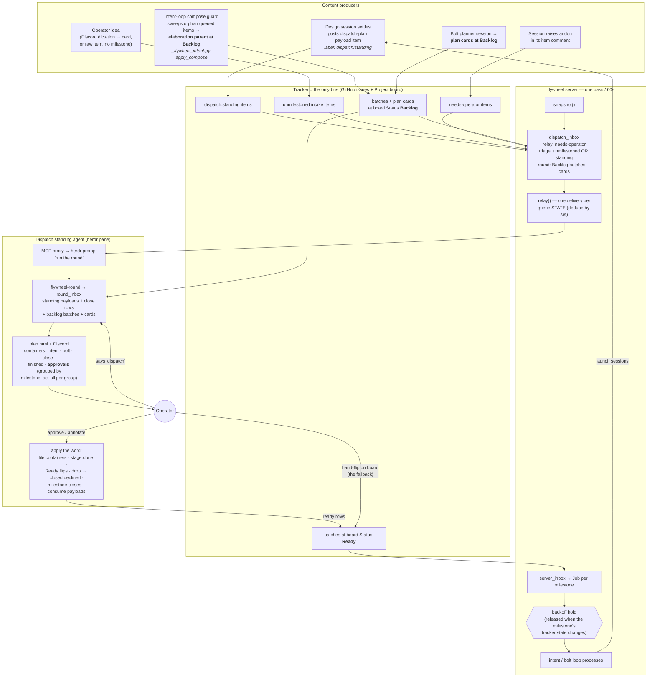

# The dispatch-round trigger flow

Every channel and event that produces a dispatch plan, and what happens
after the operator's word. This is the current-state map — when a round
doesn't appear or work doesn't move, diagnose against this picture
first. Companion: `skills/_reference/dispatch-plan.md` (the protocol),
`bin/_flywheel_inbox.py` (the derivations), `bin/_flywheel_server.py`
(the pass).

## The three trigger channels, in words

1. **The server's poke** — every 60s pass derives `dispatch_inbox` from
   the snapshot: `relay` (needs-operator items — escalations, andons),
   `triage` (unmilestoned intake + `dispatch:standing` payload
   anchors), and `round` (batches and plan cards parked at board
   Backlog on open milestones). Each non-empty queue whose membership
   changed since the last delivery is prompted into the dispatch pane
   as one imperative. An unchanged queue is delivered once, not every
   pass.
2. **The operator's word** — "dispatch" in Discord or the pane runs a
   round on the spot; no poke needed.
3. **Nothing else.** Loops never talk to dispatch; sessions never talk
   to dispatch; everything routes through tracker state the pass can
   derive.

## What the round is over

`round_inbox` is a pure function of the snapshot: standing payloads
(the label nominates the anchor, the marker comment carries the
address), close-ready bolt milestones (every work item merge-closed,
nothing ready, no open card), and the Backlog batches/cards. Derived
Backlog rows render in the **approvals** container — grouped by
milestone, one set-all per group, routes `leave | ready | drop`,
seeded `leave` — so approving the one new elaboration never requires
touching twenty parked bolt cards, and `drop` retires a card for good
(`closed:declined`) instead of resurfacing it every round.

## After the word

Ready is the only release: the server's next pass turns Ready work
into loop jobs, holds are keyed to milestone tracker state (an
operator repair — a label cleared, a status flipped — releases the
hold on the next pass), and the loops launch the sessions whose
settles feed the next round.
