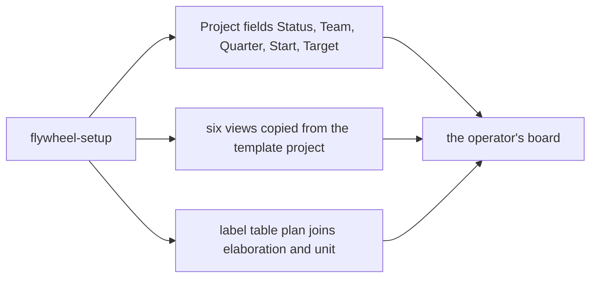

# Bolt: board-surface

The org Project gains the fields and the views the book's tracker
protocol describes, and `flywheel-setup` converges them the way it
already converges labels. This is first because the two behaviors the
next bolt builds — the planner setting a card's Team, and expansion
refusing a card without one — both need a field that does not exist yet.

Sequence: 1 of 8 · builds on: none

| # | change | delivers | chapters | why this bolt |
|---|--------|----------|----------|---------------|
| 1 | `project-fields` | Status, Team, Quarter, Start and Target on the org Project, carried by batch parents and by no sub-issue | `books/flywheel/src/tracker-protocol.md` | Team is a precondition of the planner and of expansion; the other three slice the views this bolt also lands |
| 2 | `project-views` | the six views — Kanban, Roadmap, Triage, Waiting On Me, In Flight, Landed — copied by `flywheel-setup` from a hand-built template project, one per org | `books/flywheel/src/tracker-protocol.md` | views cannot be created through the API, so the copy step is the only way an org gets them, and the operator reads the board through them from the next bolt on |
| 3 | `plan-label` | `plan` joins the label table `flywheel-setup` converges, beside `elaboration` and `unit`, described as one proposed bolt awaiting approval | `books/flywheel/src/tracker-protocol.md`, `books/flywheel/src/lifecycles.md` | a loop writing a label the repo does not carry is a failed edit, not a created label |

## Left out

- Anything that reads Team to route a milestone to a host — that is
  `fleet-across-hosts`, and this bolt only makes the field exist.
- Anything that writes a `plan` card. The planner is the next bolt; this
  one leaves the label converged and unused.
- The Status option set stays exactly Backlog and Ready. No option is
  added for session completion, which lives in `stage:*` labels.

Derived from: book 2243c39f · specs aa1debe · in flight: none bearing on
the Project's fields or views
