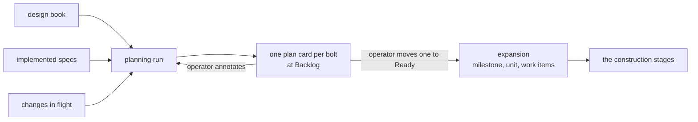

# Bolt: derived-backlog

The bolt planner does not exist. This bolt builds it end to end: a
planning run that reads a design book, the built repo's implemented
specs, and the changes in flight, returns one plan document per proposed
bolt, files each as a card at board Backlog, and lets the bolt loop
expand the one the operator moves to Ready. It is the largest cut in the
sequence and the one that makes the backlog a measurement rather than a
stored queue.

Sequence: 2 of 8 · builds on: `board-surface`

| # | change | delivers | chapters | why this bolt |
|---|--------|----------|----------|---------------|
| 1 | `bolt-planner-session` | the planning run: the three inputs and nothing else, the cut into sequenced bolts, one plan document per bolt with its task table, chapter citations, diagram and price | `books/flywheel/src/bolt-planning.md`, `books/flywheel/src/sessions.md` | nothing downstream has an input until a run produces plan documents |
| 2 | `plan-cards` | one `plan` card per proposed bolt at Backlog, the plan document as its body, Team set at filing, the input commits recorded on the card, and earlier unapproved cards closed `closed:superseded` | `books/flywheel/src/bolt-planning.md`, `books/flywheel/src/tracker-protocol.md`, `books/flywheel/src/lifecycles.md` | the cards are the planner's only tracker write, and the operator's approval gesture needs something to move |
| 3 | `planner-triggers` | the reconcile pass charges a run on missing or stale cards once the book has been quiet for the settle window, on a landing, or on the operator's scoped ask, and between runs marks unapproved cards stale as their input commits move | `books/flywheel/src/bolt-planning.md`, `books/flywheel/src/server-and-fleet.md`, `books/flywheel/src/tracker-protocol.md` | a planner nobody charges makes the board empty for want of an ask, which the first-quiet-pass rule exists to prevent |
| 4 | `plan-expansion` | the bolt loop's first pass: create `bolt/<slug>`, move the card onto it as the unit, file one work item per plan task with its chapter citations, consume the Ready status, copy the plan into the bolt's charter, and refuse a card carrying no Team | `books/flywheel/src/bolt-planning.md`, `books/flywheel/src/construction-loop.md`, `books/flywheel/src/lifecycles.md` | approval has to reach construction, and an unroutable bolt is a defect at approval time rather than a discovery at runtime |
| 5 | `builds-on-defer` | a card approved before the bolt it names as its predecessor has landed waits, and the run record says so | `books/flywheel/src/bolt-planning.md` | approval order is the operator's and build order is the plan's, so the predicate defers rather than refusing or serializing the board |

## Left out

- Retiring the release path the repo has today. Both births of a bolt
  coexist through this bolt and the older one closes in
  `design-loop-ends-at-the-book`; retiring it here would stop
  construction before its replacement had run once.
- The bolt charter's artifact set. Expansion copies the plan into
  `bolt.md` as the schema stands; `records-not-registries` is where the
  schema loses `proposals.md` and its `tasks.md`.
- Which host runs the charged planning run. Team is set on the card here
  and read by `fleet-across-hosts`.

## Open before this bolt is buildable

Two facts the book does not carry, both needed by change 3:

- **The system-to-book binding.** The reconcile pass charges the planner
  when a system's cards are missing or stale and its book has settled.
  `fleet.yaml` names the tracker, the hosts, `loops_cwd:` and `teams:`;
  nothing names which design book belongs to which built repo, or where
  that book is checked out.
- **The settle window.** The book states that the pass waits for the
  book to be quiet for a settle window without giving it a value or
  saying whether it is configuration.

Derived from: book 2243c39f · specs aa1debe · in flight: `observer`
(the run record change 5 writes to), `add-flywheel-loops`
