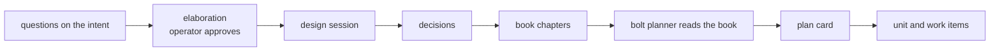

# Bolt: design-loop-ends-at-the-book

The design loop's output is the book, and nothing moves from an intent's
items to a bolt. Today an intent conductor prepares a handoff, the
operator's phase gate releases it, and a bolt is born from that release —
a second route into construction beside the plan card the previous bolt
built. This bolt closes it: the handoff task type, the handoff session
type, and both release paths retire, leaving expansion the only way a
unit and a bolt milestone come into existence.

Sequence: 3 of 8 · builds on: `derived-backlog`

| # | change | delivers | chapters | why this bolt |
|---|--------|----------|----------|---------------|
| 1 | `retire-handoff-task-type` | the intent schema's typed sections lose Handoff, and no instruction describes a route from an intent's task to a built repo | `books/flywheel/src/schemas.md`, `books/flywheel/src/design-loop.md` | the schema's own instructions are the one steering surface every agent renders, so the retired route has to stop being described there first |
| 2 | `retire-handoff-session-type` | `flywheel:handoff` and its type go; the design types are planning, research, prototype and interactive | `books/flywheel/src/design-loop.md`, `books/flywheel/src/sessions.md` | a type whose deliverable is a release request has no deliverable once the release path is gone |
| 3 | `expansion-is-the-only-unit-birth` | the born-ready release and the handoff birth of a unit parent retire; a unit is what an approved plan card becomes, and it is created nowhere else | `books/flywheel/src/tracker-protocol.md`, `books/flywheel/src/lifecycles.md`, `books/flywheel/src/bolt-planning.md` | two births for one object is what makes the board hard to read, and the plan card's is the one the book keeps |
| 4 | `intent-loop-stops-releasing` | the intent loop's filter is questions, elaborations and collection; it charges no release and moves no item to a bolt milestone | `books/flywheel/src/design-loop.md`, `books/flywheel/src/tracker-protocol.md` | the loop and the planner meet nowhere, and a release branch left in the loop is a path that can still fire |

## Left out

- The intent change's artifact set. Retiring the Handoff *type* leaves
  `tasks.md` standing with two types in it; `records-not-registries`
  removes the file.
- The construction-side types that were only ever fed by a release —
  proposal-review and proposal-writing — retire with the registry in
  `session-types-match-the-loops`.
- The operator's phase gate as a concept. It survives as board approval,
  which is the same gesture applied to a plan card.

Derived from: book 2243c39f · specs aa1debe · in flight:
`loops-run-unattended` (its 2026-08-14 handoff cut no bolt and queued
nothing), `add-flywheel-loops`
