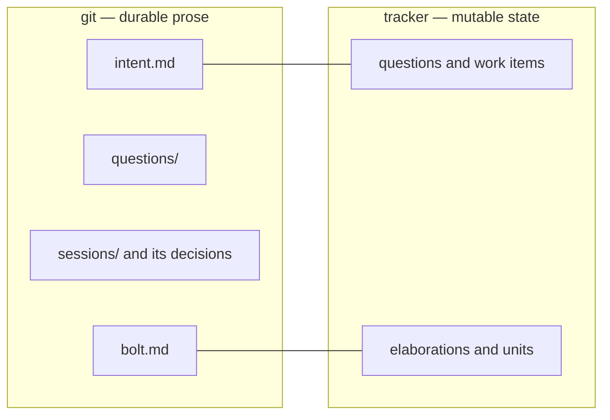

# Bolt: records-not-registries

Durable prose lives in git and work state lives on the tracker, and
nothing is recorded in both places. Three files break that today:
the intent's `tasks.md` and `design.md`, and the bolt's `proposals.md`
registry with its forward-only status ladder. Each is a work list in git
whose state the tracker also carries. This bolt reduces both schemas to
the artifact sets the book names.

Sequence: 4 of 8 · builds on: `design-loop-ends-at-the-book`

| # | change | delivers | chapters | why this bolt |
|---|--------|----------|----------|---------------|
| 1 | `intent-artifact-set` | `flywheel-intent` generates `intent.md`, `questions/**`, `sessions/**` and `prototypes/**` and nothing else; `tasks.md` and `design.md` retire, and the intent's work list is its milestone's items batched into elaborations | `books/flywheel/src/schemas.md`, `books/flywheel/src/commitments.md`, `books/flywheel/src/lifecycles.md` | the typed task file is the last stored queue on the design side, and the tracker already carries every state it holds |
| 2 | `decisions-are-session-deliverables` | a decision file is written by the session that produced it, in its own directory, carrying the options weighed and why the losers lost — the chapter carries the destination | `books/flywheel/src/design-loop.md`, `books/flywheel/src/schemas.md`, `books/flywheel/src/lifecycles.md` | with `tasks.md` gone the conductor's promote-and-check-off step has nothing to check, so the writer of a decision has to be settled in the same cut |
| 3 | `bolt-charter-only` | each `bolt-*` member's one artifact is `bolt.md` — scope, source intents, involved repos and branches, merge criteria; `proposals.md` and the bolt's `tasks.md` retire and the milestone's work items are the list | `books/flywheel/src/schemas.md`, `books/flywheel/src/commitments.md`, `books/flywheel/src/bolt-planning.md` | the registry's rows and the milestone's items are two stores of one fact, and expansion already files the items |

## Left out

- The `loop:` block and the four bolt types. They are built and the book
  describes them as they are; nothing here touches them.
- The session types that lose their subject when the registry goes.
  Retiring proposal-review and proposal-writing is the next bolt.
- Migrating live changes off the retired artifacts. A schema change that
  strands an open change is a sequencing act, and the changes in flight
  named below are what it has to clear.

## Open before this bolt is buildable

`openspec/changes/add-flywheel-loops/` carries four unarchived
`## ADDED Requirements` deltas, two of which — `flywheel-intent-schema`
and `flywheel-bolt-schema` — specify the artifact sets this bolt
removes. Building against the book here contradicts deltas that have not
landed. That change is archived, retired, or its two schema deltas are
superseded before this bolt starts; which of the three is the operator's
call.

Derived from: book 2243c39f · specs aa1debe · in flight:
`add-flywheel-loops` (conflicting schema deltas), `gated-merge-guarantee`,
`machinery-self-desc`, `relay-delivery`, `work-object-vocabulary` — all
four bound to `flywheel-intent` and holding artifacts this bolt retires
