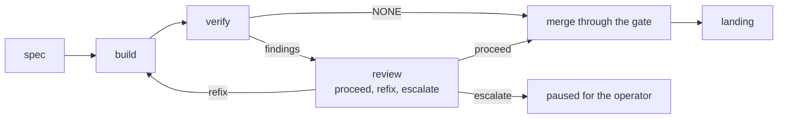

# Bolt: session-types-match-the-loops

The repo ships thirteen session-type skills. The book names eight types:
four design types on one side and the construction stages that run as
sessions on the other. This bolt brings the set to the one the two loop
chapters describe — retiring the types whose subject the last two bolts
removed, folding synthesis into every design session's close, and giving
the review stage the ruling the construction loop reads.

Sequence: 5 of 8 · builds on: `records-not-registries`

| # | change | delivers | chapters | why this bolt |
|---|--------|----------|----------|---------------|
| 1 | `design-types` | planning, research, prototype and interactive; writeback retires as a type and synthesizing outcomes into the book's chapters becomes the last step of every design session | `books/flywheel/src/design-loop.md`, `books/flywheel/src/sessions.md` | synthesis runs as often as a session's decisions demand, which a type charged separately cannot deliver |
| 2 | `construction-types` | spec, build, verify, review and landing; proposal-review, proposal-writing, test, code-review and human-code-review retire into those five | `books/flywheel/src/construction-loop.md`, `books/flywheel/src/sessions.md` | the stages are what the loop drives, and a type the loop never charges is a skill nothing loads |
| 3 | `review-ruling` | the review session runs only when verify found something and writes `proceed`, `refix` with the prompt to send, or `escalate` with the reason, to the file the loop reads — an unreadable ruling escalates | `books/flywheel/src/construction-loop.md`, `books/flywheel/src/contracts.md` | the loop's branch after verify depends on a ruling in a fixed shape, and today's bounded spec review is a different judgment at a different point |

## Left out

- The model tiers. The book has the profile name the tier so a plan
  document can price a bolt; the pricing line lands with the plan
  document in `derived-backlog`, and the tier table the repo already
  carries is left where it is until a plan reads it.
- The four host profiles. Dispatch, design session, interactive session
  and construction session already exist and already cover every type in
  the reduced set.
- The adversarial review stage `bolt-adversarial` schedules. The book
  states that the type adds an independent adversarial review before
  merge without saying where in the stage order it sits or what artifact
  it writes; see below.

## Open before this bolt is buildable

`bolt-adversarial` "adds independent adversarial review before merge".
The book does not say whether that review is a sixth stage, a second
charge of the review type, or a hook the `loop:` block attaches — nor
what it writes for the loop to read. The other three types are fully
specified by the construction loop's stage order; this one is not.

Derived from: book 2243c39f · specs aa1debe · in flight:
`work-object-vocabulary` (renames two of the type skills this bolt
retires — see the sequence note), `machinery-self-desc`
