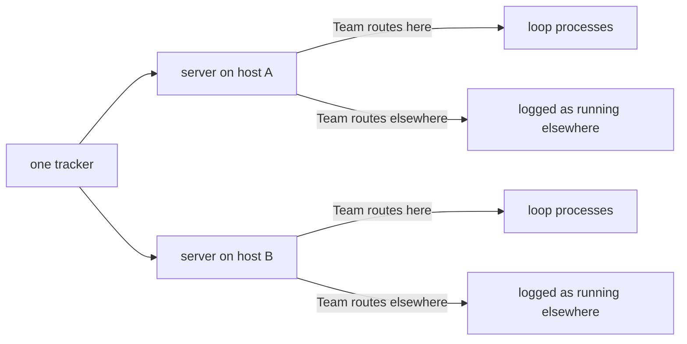

# Bolt: fleet-across-hosts

Multi-host operation is a server per host sharing one tracker, routed by
the board's Team field. The field exists after `board-surface` and the
planner sets it on every card, but nothing reads it: one server today
starts every loop it finds a job for. This bolt makes the routing real
and lands the server verbs and timers the book names and the specs do
not.

Sequence: 6 of 8 · builds on: `board-surface`

| # | change | delivers | chapters | why this bolt |
|---|--------|----------|----------|---------------|
| 1 | `teams-routing` | each server starts only the loops the manifest's `teams:` map routes to it, and logs the rest as running elsewhere | `books/flywheel/src/server-and-fleet.md` | two servers reading one tracker with no routing both start the same loop |
| 2 | `re-teaming-moves-a-loop` | re-teaming a milestone stops the process on the old host and starts a fresh one on the new, which re-reads everything | `books/flywheel/src/server-and-fleet.md` | the loops are stateless, so a move needs no handover and the operator gets one gesture for it |
| 3 | `cli-verbs` | `flywheel down` stops the server and every loop process for the org while dispatch and the herdr session stay; `flywheel server --once --dry-run` prints one pass without starting anything | `books/flywheel/src/server-and-fleet.md` | the verb table in the book is the fleet's whole surface, and two rows of it are missing |
| 4 | `idle-backoff` | a loop that exits with the tracker unchanged is held on a doubling backoff from one minute to fifteen, released the moment the tracker moves | `books/flywheel/src/server-and-fleet.md` | a sixty-second tick restarting a loop with nothing to do is the fleet's steady-state cost |
| 5 | `pane-reaping` | a pane matching no live job closes once the run report has recorded what it held | `books/flywheel/src/server-and-fleet.md`, `books/flywheel/src/sessions.md`, `books/flywheel/src/observation.md` | stall evidence outlives its stall exactly until the operator has read it, which is a condition only the report can answer |

## Left out

- The gate-readiness precondition, which already binds every command
  that starts an actor and is unchanged by routing.
- `flywheel approve`, which the `observer` change in flight is building
  along with the hold it releases.

## Sequencing note

Change 5 reads whether a run report has recorded a pane's contents. That
report is `observer`'s, so this change waits on that landing; the other
four do not.

Derived from: book 2243c39f · specs aa1debe · in flight: `observer`
(change 5 depends on its report), `machinery-self-desc`
