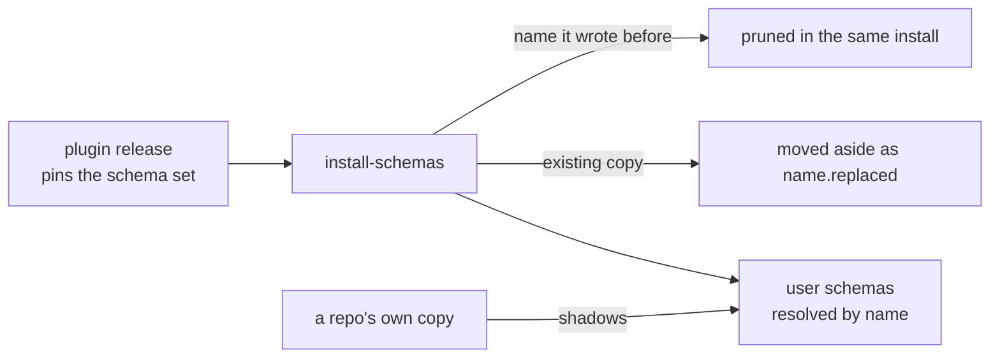

# Bolt: schema-distribution

The plugin release carries the schemas and installs them as user schemas
so any repo on the machine resolves them by name. The book states two
rules about that install the specs do not pin: the installer owns the
names it wrote and nothing else, and a published version is immutable.
This bolt lands both, and it depends on nothing else in the sequence.

Sequence: 7 of 8 · builds on: none

| # | change | delivers | chapters | why this bolt |
|---|--------|----------|----------|---------------|
| 1 | `install-owns-its-names` | an install moves an existing user copy aside as `<name>.replaced` rather than destroying it, prunes the stale names the installer itself wrote, and leaves untouched any schema it never wrote | `books/flywheel/src/schemas.md` | a renamed schema that keeps resolving under its old name lets a repo bind a name the plugin no longer ships |
| 2 | `calver-versions` | a schema names its version in calver, a version is immutable so a change ships as the next cut, and the plugin release pins the set it carries | `books/flywheel/src/schemas.md` | a machine has to be able to state which cut it resolves, which an edited-in-place version makes impossible |

## Left out

- Contract extraction. The book records that no contract is extracted
  yet and gives the order for when one is; the schemas are last on that
  list and nothing here needs them extracted.
- `openspec schema fork` erasing the `loop:` block from the copy it
  writes. That behavior belongs to OpenSpec, not to this repo.

## Note on measurement

No spec in `openspec/specs/` covers the installer, so this plan derives
the whole of it from the book. The first change re-measures what
`bin/install-schemas` already does before writing anything, and a rule
already held is a task that closes with evidence rather than an edit.

Derived from: book 2243c39f · specs aa1debe · in flight: none bearing on
schema installation
