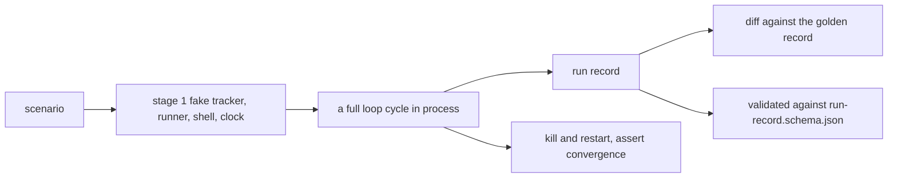

# Bolt: verification-stages

The loop programs are ordinary Python, so a full cycle — guards, stages,
merges, pauses — runs as a unit test with no herdr, no `claude`, no
token, no network and no sleeping. The book's verification chapter names
the QA infrastructure that rests on that fact: a fake tracker and its
scenario library, golden run records, a restart harness, and contract
tests at the boundaries. This bolt builds the frame every later change
docks onto instead of shipping scaffolding of its own.

Sequence: 8 of 8 · builds on: the `observer` change landing

| # | change | delivers | chapters | why this bolt |
|---|--------|----------|----------|---------------|
| 1 | `fake-stage` | the in-process stage 1 backend — a fixture tracker seeded from a scenario, a scripted runner playing session outcomes back on cue, a fake shell answering `git`, `openspec` and `wt` from a table, and a fake clock | `books/flywheel/src/verification.md` | every other harness in this bolt runs on this backend, and stage 1 is the default a test declares |
| 2 | `scenario-library` | the fixture library under `tests/` in three flavors — tracker scenarios, scripted session outcomes, golden run records — each versioned with the schema it conforms to, one name resolving to one starting state in every stage | `books/flywheel/src/verification.md` | a scenario name is what a change reuses by name when it docks, so the names have to exist before docking is a rule |
| 3 | `golden-record-comparison` | stage 2: a full run against a scenario, its run record diffed against a golden checked in beside it, the diff as the failure message | `books/flywheel/src/verification.md`, `books/flywheel/src/observation.md` | a regression read the way the operator reads a run report is the point of writing the record in a fixed vocabulary |
| 4 | `restart-recovery-harness` | kill a loop mid-run, start a fresh process against the same scenario, assert it converges without repeating a completed stage or stranding an item | `books/flywheel/src/verification.md`, `books/flywheel/src/construction-loop.md` | statelessness is the property the whole server design rests on, and nothing asserts it end to end |
| 5 | `run-record-contract` | `run-record.schema.json` extracted under `books/flywheel/contracts/`, with every record entry validated against it | `books/flywheel/src/contracts.md`, `books/flywheel/src/verification.md` | the record has three consumers — the report renderer, `flywheel approve` and these golden tests — which is the threshold the book sets for extraction |

## Left out

- Stage 3, live fire. It runs per release against a real tracker with
  the loop held, and its evidence is the operator's reading of the run
  report rather than an assertion a harness makes.
- The skill evals the repo already ships. They judge agent behavior;
  this frame judges the loop programs, and neither replaces the other.
- The other six contract candidates. The run record earns extraction
  because these tests read it; the rest wait for a consumer.

## Sequencing note

Changes 3 and 5 read the run record, which the `observer` change in
flight is writing now. This bolt is last in the sequence for that
reason, and changes 1, 2 and 4 stand on their own if it is approved
earlier.

Derived from: book 2243c39f · specs aa1debe · in flight: `observer`
(the run record and its report, plus its own ledger test suite)
