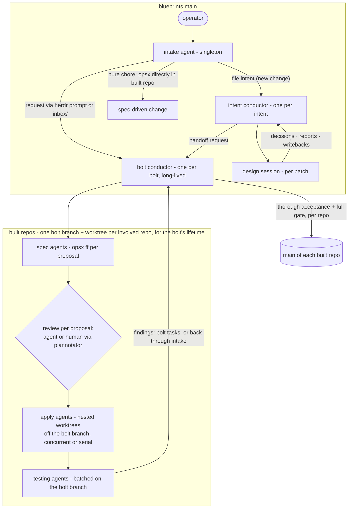

# Design

## Context

OpenSpec is the foundation of both loops. The outer (design) loop runs on
blueprints main as changes under the `flywheel-intent` schema. Construction
is tracked in `flywheel-bolt` changes, also on blueprints main, while the
code work runs in built repos as ordinary spec-driven changes. The
operator's word is the phase gate between design and construction.

## The actor model

| actor | cardinality · where | owns (sole writer) |
| --- | --- | --- |
| intake agent | singleton · blueprints main | nothing standing — creates new intent changes, then requests |
| intent conductor | per intent · blueprints main | its intent change |
| design session | per batch · blueprints main (+ spike worktrees) | its assigned `sessions/<date>-<slug>/` under the change — reports; the conductor promotes into the canonical artifacts |
| bolt conductor | per bolt · blueprints main, long-lived | its bolt change; the bolt branches/worktrees it cuts in built repos |
| spec agent | per proposal · built-repo bolt worktree | the spec-driven change it drafts |
| apply agent | per proposal · nested construction worktree | implementation on its branch |
| testing agent | per batch · bolt-branch worktree | findings reports — never fixes |

## Decisions

### Agent profiles carry role identity

Each actor has a Claude Code agent profile
(`.claude/agents/flywheel-{intake,intent-conductor,design-session,bolt-conductor}.md`)
used at launch as the *main* session's identity — herdr starts
`claude --agent <profile>` in the pane, so the role survives compaction
and arrives before any prompt. Profiles are deliberately thin: identity
and edit-scope only, pointing at the skills and schema instructions, which
remain the single statement of the practice. Per-instance binding (which
change you own) comes from the first prompt (`/opsx:continue <slug>`).
They are not Task-tool subagents — every flywheel actor runs visibly in
herdr.

### Schema resolution and coexistence

Per-change `.openspec.yaml` (`schema: flywheel-intent` or `flywheel-bolt`,
plus `skip_specs: true`) binds flywheel changes to their schemas;
`openspec/config.yaml` keeps `spec-driven` as the project default. Proven:
status auto-detects, validate passes, all schemas coexist in one changes
tree, and `openspec list` reports task progress for every kind.

### Single writer, herdr delivery, inbox fallback

A change's conductor is the only writer of its canonical artifacts; design
sessions write only their assigned `sessions/<date>-<slug>/` directory and
the conductor promotes their outputs. Requests reach a conductor via
`herdr agent prompt` (conductor running — check `herdr agent list` for
`intent-<slug>` / `bolt-<slug>`) or a file in the change's `inbox/`
(`inbox/<date>-<from>-<slug>.md`) drained at every turn start — and
draining re-enters the artifact sequence: revise the earliest artifact the
request touches, re-walk forward (`/opsx:continue`), delete the file in
the same commit. Bolts auto-start on request (they exist only past the
phase gate); intents wait on the OpenSpec UI board until the operator pulls
one. No watchers, no polling loops. Discord is the operator's channel only
(bots cannot message each other through the bridge); whether a
bridge-connected session can trigger on non-mention messages, and whether a
webhook receiver is worth having for remote intake, is an open
investigation task.

### The handoff

An intent's Handoff tasks stage settled slices. At the operator's release,
the intent conductor requests the bolt — creating the `flywheel-bolt`
change and starting `bolt-<slug>` when none exists, prompting the running
one otherwise — and never writes the bolt change itself. The bolt conductor
reports each landed proposal back the same way, and the intent's task is
checked by its own conductor.

### Monitoring and review surfaces

Monitoring is OpenSpec UI on blueprints@main: intents and bolts are
changes on its board with native task progress. The spike dashboard is
retired; the articulated-but-deferred gap — a cross-intent release queue
with ripple prediction (map edges out of staged handoffs) — is revisited
only if felt in use. Review surfaces: plannotator for written artifacts
(proposals, plans, diffs — approve/deny returns to the agent), lavish for
built interactive surfaces.

### Testing stages (construction)

Commit stage on every construction-worktree push (the repo's named checks;
`moon ci` where adopted); merge gate on the rebased tree at merge-back into
the bolt branch; batched acceptance on the bolt branch after 2–3
merge-backs, run by a one-shot testing agent; full release gate landing
each repo's bolt branch on its main; scheduled soak in CI. Acceptance never
runs inside a construction worktree.

## E2E walkthrough

`flywheel/E2E.md` narrates one intent end to end — commands, files,
sessions, skills, repos — and is the acceptance script for this change:
when every step in it works as written, the change is implementable as
specified.

## Risks

- OpenSpec's schema commands are experimental; a CLI upgrade can shift the
  metadata contract. Mitigation: schemas, metadata, and config are in-repo
  and versioned together.
- Long-lived bolt conductors are standing sessions; a dead conductor loses
  no state (everything durable is in the change + inbox) and restarts from
  its own artifacts.
- Inbox draining depends on conductor turns; a request can sit while a
  conductor is parked. Accepted: herdr prompt is the fast path, the inbox
  is the durable one, and the operator sees pending inbox files on the
  board's change diffs.
