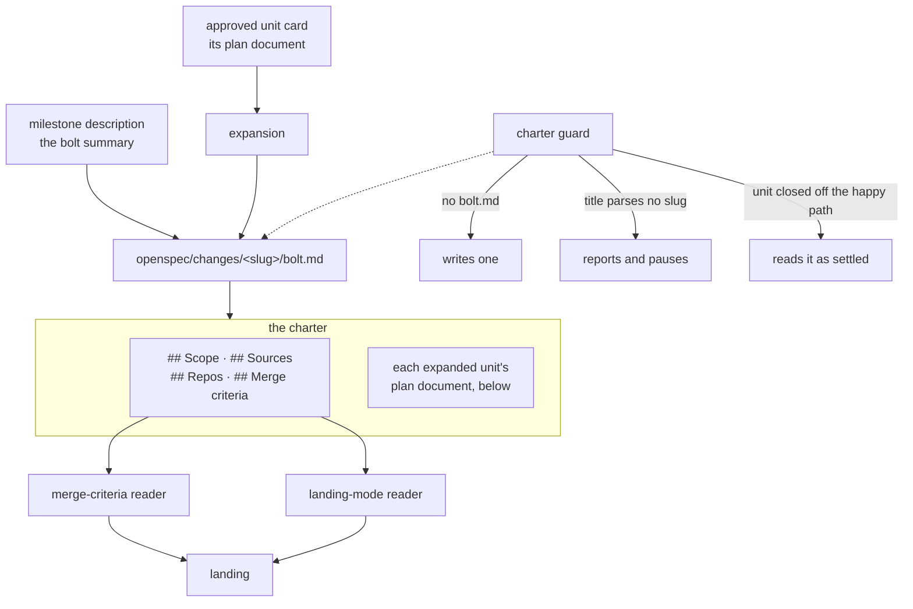

# Bolt: loop-boundaries

## Scope

Finishes the loop's boundaries: the bolt's record in git. A planner-born
charter opens with the bolt-level sections the schema names, a change
directory without a `bolt.md` gets one from a guard instead of no guard,
a unit title that parses no slug pauses with its reason instead of
vanishing, and the defer predicate reads a unit closed off the happy
path as settled. One unit approved and built: `the-bolt-charter`,
four changes.

## Sources

Derived from `books/flywheel` at book a6a25026 · specs 5ea5413. The
chapters the unit cites: `schemas.md`, `bolt-planning.md`,
`lifecycles.md`, `construction-loop.md`, `observation.md`.

## Repos

agentplot/flywheel · `bolt/loop-boundaries` · `.bare.bolt-loop-boundaries`

## Merge criteria

The four changes of `the-bolt-charter` are on the branch, archived, and
proven by the tree:

- a planner-born charter opens with scope, sources, repos and merge
  criteria, written from the milestone description
  (`the-charter-carries-the-bolt-sections`);
- a change directory that exists without a `bolt.md` is a guard's case,
  and the charter is written rather than assumed present
  (`a-charterless-change-directory-gets-one`);
- a unit title that parses no slug is reported with its reason and
  pauses the loop rather than being dropped in silence
  (`an-unparseable-unit-title-says-so`);
- a unit closed off the happy path is read as settled, so a dependent
  card defers on the predecessor's real state
  (`the-defer-predicate-reads-a-closed-unit`).

The test suite is green on the bolt branch as it would land: rebased
onto (or merged with) current main, not only in isolation. The merge
gate's own hooks run unweakened.

Landing: merge

# Unit: the-bolt-charter

System: flywheel

Expansion copies a unit's plan document into the bolt's charter, but a
planner-born charter carries none of the bolt-level sections the schema
names — so the landing runs its merge criteria against an empty string and
picks its mode from the same nothing. Its guard has three more ways to go
quiet: a change directory with no `bolt.md` gets a charter from neither
guard, a unit whose title parses no slug is dropped without a word, and a
unit closed off the happy path reads as not-merged. This unit closes all
four; it is first because `bolt/matches-the-book` is waiting to land
through exactly this path.

Sequence: 1 of 4 · builds on: none
Type: `bolt-default` · Price: 4 changes · ~3 days

| # | change | delivers | chapters | after | why this bolt |
|---|--------|----------|----------|-------|---------------|
| 1 | `the-charter-carries-the-bolt-sections` | a planner-born charter opens with the bolt-level sections the schema names — scope, sources, repos, merge criteria — written from the milestone description the planner authored, with each expanded unit's plan document riding below them; the merge-criteria reader and the landing-mode reader both find what they read for | `books/flywheel/src/schemas.md`, `books/flywheel/src/bolt-planning.md`, `books/flywheel/src/lifecycles.md` | — | the landing of every planner-born bolt reads these sections, and today they are absent |
| 2 | `a-charterless-change-directory-gets-one` | a change directory that exists without a `bolt.md` is one guard's case, not no guard's: the charter is written rather than assumed present | `books/flywheel/src/lifecycles.md`, `books/flywheel/src/construction-loop.md` | 1 | the charter it writes is the one task 1 defines |
| 3 | `an-unparseable-unit-title-says-so` | the charter guard never drops a unit in silence: a title that parses no slug is reported with its reason and pauses rather than vanishing from the charter | `books/flywheel/src/construction-loop.md`, `books/flywheel/src/observation.md` | 1 | the loop pauses and never guesses, and a silent drop is a guess |
| 4 | `the-defer-predicate-reads-a-closed-unit` | an empty work list is not evidence that a unit has not merged: a unit closed off the happy path is read as settled, so a dependent card is deferred on the predecessor's real state | `books/flywheel/src/bolt-planning.md`, `books/flywheel/src/construction-loop.md` | 1 | the defer predicate is what makes approval order the operator's and build order the plan's |

## Left out

- Rewriting the bolt schema's `bolt.md` template — the template already
  names the sections; what is missing is a charter that carries them.
- The merge criteria's own content for any particular bolt, which is the
  planner's summary and the operator's to annotate.

Derived from: book a6a25026 · specs 5ea5413 · in flight: observer, add-flywheel-loops

