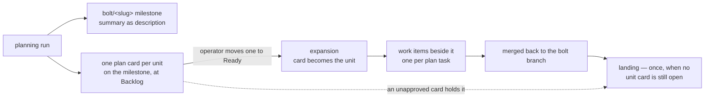

# Unit: bolt-of-units

System: flywheel

The board model the book now states: the planner creates the bolt
milestone and files one card per unit onto it, expansion turns an approved
card into that unit rather than into a whole bolt, and the landing runs
once for the bolt when no unit card is still open. It is first because
every other unit's tracking rides on it — the release paths, the session
set, and the golden records all describe writes this shape defines.

Sequence: 1 of 5 · builds on: none

| # | change | delivers | chapters | after | why this bolt |
|---|--------|----------|----------|-------|---------------|
| 1 | `planner-owns-the-milestone` | the planner creates `bolt/<slug>` with the bolt summary as its description and files one `plan` card per unit onto it, titled `Unit: <slug>`, Team set at filing, builds-on mirrored as blocked-by, earlier unapproved cards closed superseded | `books/flywheel/src/bolt-planning.md`, `books/flywheel/src/tracker-protocol.md` | — | the card's title and home are what every later filter reads |
| 2 | `expansion-makes-a-unit` | expansion relabels the approved card `unit`, consumes its Ready status, files one item per plan task as its sub-issues on the same milestone, and writes the plan into the bolt's charter; idempotent; refuses a card with no Team; defers a card blocked by an unlanded predecessor | `books/flywheel/src/bolt-planning.md`, `books/flywheel/src/lifecycles.md` | 1 | a card that is already on its milestone cannot be expanded by a step that creates one |
| 3 | `the-landing-waits-for-the-cards` | the landing runs once per bolt — when every merged item awaits it and no unit card on the milestone is still open — and the loop closes the units `closed:done` after it; an unapproved card holds the landing | `books/flywheel/src/bolt-planning.md`, `books/flywheel/src/construction-loop.md`, `books/flywheel/src/lifecycles.md` | 2 | the landing's new precondition is the unit set expansion produces |
| 4 | `the-bolt-job-filter` | the server yields a bolt job for a `plan` card at Ready on a `bolt/*` milestone and counts unexpanded cards as work; a card is no longer read as a bolt waiting to be created | `books/flywheel/src/server-and-fleet.md`, `books/flywheel/src/tracker-protocol.md` | 1 | the filter reads the card's milestone, which task 1 is what puts there |

## Left out

- Marking cards stale and charging a planning run — already implemented,
  and the triggers do not change with the card's shape.
- The plan card's own body format beyond title and Team; the planner
  writes it, and no loop parses it.

Derived from: book 61e9151e · specs cce9c5c · in flight: observer, add-flywheel-loops

