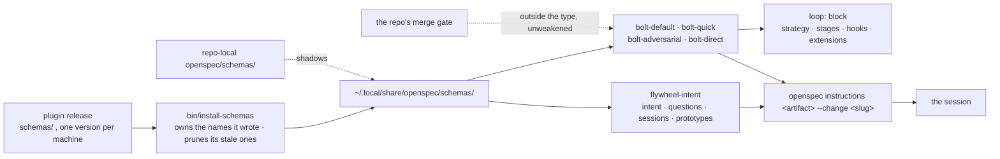

# Bolt: schema-alignment

System: flywheel

The schemas are the contract between a change and the loop that works
it, and they still describe the older artifact set and carry no
versioning story. This bolt moves the five schemas onto the artifacts
the book names, states the `loop:` block as the bolt type, and makes
the installed set something a machine can name exactly.

Sequence: 4 of 4 · builds on: session-type-set

Price: `bolt-default` — per item a spec and a build session (`opus[1m]`)
and a verify session (`opus[1m]`), a review session (fable) only when
verify finds something; one landing session at the end.

| # | change | delivers | chapters | after | why this bolt |
|---|--------|----------|----------|-------|---------------|
| 1 | intent-schema-artifacts | `flywheel-intent`'s artifacts as the book states them — `intent.md`, `questions/`, `sessions/<date>-<type>/`, `prototypes/` — with decision files as session deliverables inside the session directory, and `decisions/`, `design.md`, `assertions/` and the typed Handoff section retired | books/flywheel/src/schemas.md, books/flywheel/src/design-loop.md, books/flywheel/src/lifecycles.md | — | the design half of the schema set; the bolt members read none of it |
| 2 | bolt-schema-loop-block | the four `bolt-*` members and the `loop:` block that is the type — strategy, stages, hooks, extensions — with the repo's merge gate outside the type and running unweakened on all four, `openspec` blind to the block, and `openspec schema fork` erasing it from the copy it writes | books/flywheel/src/schemas.md, books/flywheel/src/construction-loop.md | — | the construction half; it names the stages the previous bolt fixed and nothing the intent schema holds |
| 3 | schema-versioning-and-install | calver names, a published version immutable so a change ships as the next cut, an installer that owns only the names it wrote and prunes its own stale ones in the same install, `<name>.replaced` never destroyed, and the repo-local copy that shadows the user copy | books/flywheel/src/schemas.md | — | distribution is orthogonal to what any schema contains |
| 4 | instructions-as-the-only-read | `openspec instructions <artifact> --change <slug>` as the one path by which a session reads a schema, and no session reading `schema.yaml` by hand | books/flywheel/src/schemas.md, books/flywheel/src/sessions.md | 1 | the instruction text it routes to is the artifact set task 1 rewrites |

## Left out

- The contracts chapter's extraction list, including the OpenSpec
  schema set it names as a candidate. The extracted files live in the
  book repo, which construction never writes; who extracts them is an
  open question for the operator.
- Migration of changes already bound to the retiring artifact names.
  The schemas chapter says a retired type must not strand a live
  intent, and the in-flight `add-flywheel-loops` change is bound to the
  old set — that reconciliation wants the operator's word before it is
  planned.

Derived from: book 66e3f169 · specs cce9c5c · in flight: add-flywheel-loops, observer
