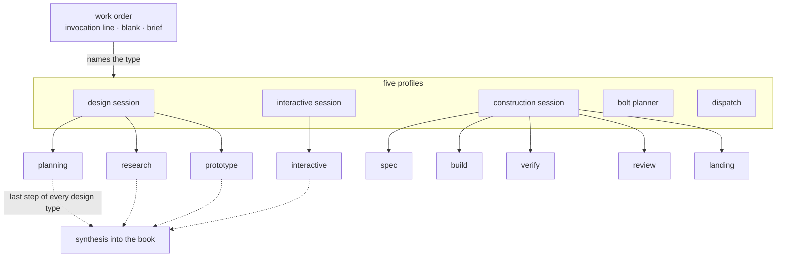

# Bolt: session-type-set

System: flywheel

Thirteen session types ship today; the book names nine — four design
types and five construction stages that run as sessions — and folds
the rest away. This bolt moves the type set, the skills that steer it,
and the work order that names it onto what the book states, so a
profile, a skill, and a stage all answer to the same list.

Sequence: 3 of 4 · builds on: work-object-vocabulary

Price: `bolt-default` — per item a spec and a build session (`opus[1m]`)
and a verify session (`opus[1m]`), a review session (fable) only when
verify finds something; one landing session at the end.

| # | change | delivers | chapters | after | why this bolt |
|---|--------|----------|----------|-------|---------------|
| 1 | design-type-set | the four design types — planning, research, prototype, interactive — with synthesis into the book as the last step of each rather than a type of its own; writeback and handoff stop being types | books/flywheel/src/design-loop.md, books/flywheel/src/sessions.md | — | the design half of the table stands alone; nothing in the construction half reads it |
| 2 | construction-type-set | the construction types the stages charge — spec, build, verify, review, landing — replacing proposal-review, proposal-writing, test, code-review and human-code-review, with review as the operator's proxy that rules rather than a mode a row declares | books/flywheel/src/construction-loop.md, books/flywheel/src/sessions.md | — | the names are the stage names the previous bolt fixed, so this is the last place they are still spelled the old way |
| 3 | work-order-shape | the work order's fixed shape enforced by the launcher — invocation line, blank line, brief — carrying the change id, the items and the goal, and carrying no tracker narrative and no escalation instructions; the type is named in the work order and its model tier is what prices a plan | books/flywheel/src/sessions.md, books/flywheel/src/bolt-planning.md | 2 | the shape restates the type table task 2 rewrites; the two would write the same lines |
| 4 | session-idempotence-and-runners | one name and one session — the id derived from the name and never remembered, a warm agent reused and never re-sent its work order — the runner chosen per stage by supervision need, and the program's real-clock waits: ninety minutes to `needs-operator`, four hours to a declared stall with the pane left as evidence | books/flywheel/src/sessions.md, books/flywheel/src/observation.md | — | launch and waiting are the loop's own mechanics and touch no type name |

## Left out

- Which review stages each bolt type schedules. That is the `loop:`
  block in the schemas, and it moves with the schemas in the next
  bolt.
- The permission posture per stage and the rule that a prompt is never
  batch-approved by pattern. Stated in the same chapter, but it is a
  launcher concern with no bearing on the type set, and it can ride a
  later bolt without holding this one.

Derived from: book 66e3f169 · specs cce9c5c · in flight: add-flywheel-loops, observer

