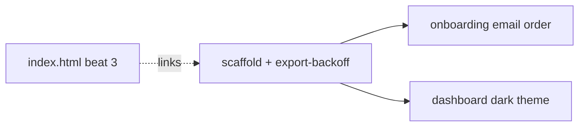

# Unit: concept-tour-pages

System: flywheel site

Three scrollytelling tour pages, each one idea walked end to end — export
backoff, onboarding email order, dashboard dark theme — the rail pinning
and advancing on scroll, every step showing the artifact it leaves behind,
the fifth step titled **approval**. Beat 3 of the home page links them.

This bolt runs the plan-mode path: no spec stage — the unit binds straight
to a plan-mode build, and this card with its cited sources is the plan.
Wording rule throughout: the coupling is *approval*; *gate* and *release*
never appear outside quoted machinery output
(`openspec/changes/site-teaches-the-system/decisions/coupling-word.md`).

Sequence: 3 of 3 · builds on: unit-1-home-page-five-beats (contention —
beat-3 links write `site/index.html`; derivation — the pages inherit the
shipped design system)

| # | change | delivers | sources | after | why this bolt |
|---|--------|----------|---------|-------|---------------|
| 1 | tour-scaffold-export-backoff | the scrollytelling scaffold + the export-backoff page; beat-3 links in `index.html` | `sessions/2026-08-18-beats-and-tour/site-mockups.html` (decision 2) · `sessions/2026-08-18-beats-and-tour/README.md` (Q4, Q5, folded corrections) · `decisions/coupling-word.md` | — | the scaffold is proven on one full concept before reuse |
| 2 | tour-onboarding-email | the onboarding-email-order page on the scaffold | `sessions/2026-08-18-beats-and-tour/site-mockups.html` (decision 2) · `README.md` (Q4) | 1 | derivation — reuses the scaffold change 1 lands |
| 3 | tour-dashboard-dark-theme | the dashboard-dark-theme page on the scaffold | `sessions/2026-08-18-beats-and-tour/site-mockups.html` (decision 2) · `README.md` (Q4) | 1 | derivation — same scaffold |

## Left out

- A fourth concept or an architecture tour — out of brief per the settled
  round: the subject is one idea's journey, never the machine from outside.

Derived from: session artifacts @ faedc0a (`openspec/changes/site-teaches-the-system`) · in flight: none
