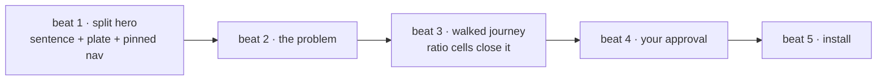

# Unit: home-page-five-beats

System: flywheel site

The stranger landing on the flywheel page gets the five-beat read: one
plain AI-DLC-harness sentence above the fold beside the plate, the problem,
a compact walked journey, your approval, install. This is the intent's core
closure and every other unit hangs off it, so it goes first.

This bolt runs the plan-mode path: no spec stage — the unit binds straight
to a plan-mode build, and this card with its cited sources is the plan.
Wording rule throughout: the coupling is *approval*; *gate* and *release*
never appear outside quoted machinery output
(`openspec/changes/site-teaches-the-system/decisions/coupling-word.md`).

Sequence: 1 of 3 · builds on: none

| # | change | delivers | sources | after | why this bolt |
|---|--------|----------|---------|-------|---------------|
| 1 | site-home-five-beats | `site/index.html` restructured to the five beats: variant-A split hero (plain sentence left with the deck under it, plate right at ~46%, five-beat nav pinned in view), the problem moved up and shrunk, the compact walked journey with the ratio cells as its closing row, "your approval — and how little it costs", install last; operator reference removed per the move-plan table | `openspec/changes/site-teaches-the-system/decisions/page-teaching-order.md` · `sessions/2026-08-18-beats-and-tour/site-mockups.html` (decision 1) · `sessions/2026-08-18-beats-and-tour/README.md` (Q1–Q3) | — | the fold and the teaching order are what this intent settled |

## Left out

- The Overview destination for the removed reference — unit 2.
- The tour pages beat 3 links to — unit 3.

Derived from: session artifacts @ faedc0a (`openspec/changes/site-teaches-the-system`) · in flight: none
