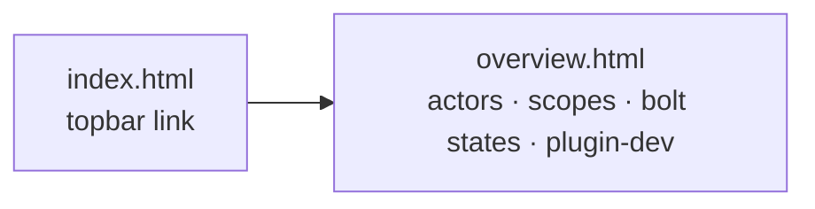

# Unit: overview-reference-page

System: flywheel site

The operator reference the home page sheds — the actor table, the
write-scope diagram, the bolt state machine, "working on the flywheel
itself" — lands on its own page, diagrams rendered and linkable, so unit
1's cuts have a destination. Linked from the topbar beside GitHub/Docs.

This bolt runs the plan-mode path: no spec stage — the unit binds straight
to a plan-mode build, and this card with its cited sources is the plan.
Wording rule throughout: the coupling is *approval*; *gate* and *release*
never appear outside quoted machinery output
(`openspec/changes/site-teaches-the-system/decisions/coupling-word.md`).

Sequence: 2 of 3 · builds on: unit-1-home-page-five-beats (contention —
both write `site/index.html`: the rebuild there, the topbar link here)

| # | change | delivers | sources | after | why this bolt |
|---|--------|----------|---------|-------|---------------|
| 1 | site-overview-page | `site/overview.html` in the site's design system carrying the demoted reference; topbar link from `index.html` | `sessions/2026-08-18-beats-and-tour/README.md` (Q2) · `sessions/2026-08-18-beats-and-tour/site-mockups.html` (move-plan table) | — | the home page's cuts land only if the content has a home |

## Left out

- Any restructure of the README — it stays the reference of record.

Derived from: session artifacts @ faedc0a (`openspec/changes/site-teaches-the-system`) · in flight: none
