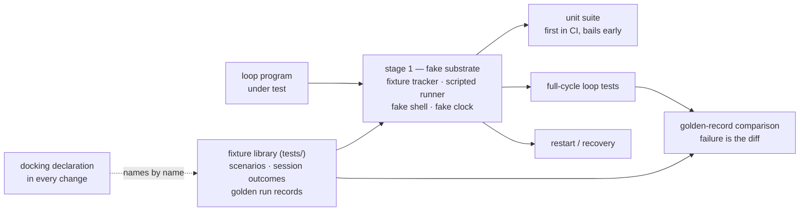

# Bolt: verification-frame

System: flywheel

This bolt builds the QA frame the verification chapter describes: the
fake substrate a loop runs against in-process, the fixture library
every change reuses by name, and the harnesses that turn a loop's
behavior into a diff. It is first because every later bolt in this cut
rewrites loop behavior, and a golden-record diff is how such a rewrite
is proven rather than argued.

Sequence: 1 of 4 · builds on: none

Price: `bolt-default` — per item a spec and a build session (`opus[1m]`)
and a verify session (`opus[1m]`), a review session (fable) only when
verify finds something; one landing session at the end.

| # | change | delivers | chapters | after | why this bolt |
|---|--------|----------|----------|-------|---------------|
| 1 | verification-backend-stages | the three declared backend stages — fake (default), golden record, live fire — and the stage-1 substrate: fixture tracker, scripted runner, fake shell, fake clock | books/flywheel/src/verification.md | — | nothing else in the frame can be built until a loop can run in-process with no herdr, no token, and no clock |
| 2 | verification-fixture-library | the fixture library under `tests/`: tracker scenarios (a unit with ready items, a bolt mid-build, a torn close, an empty queue), scripted session outcomes (findings files and the `NONE` sentinel, ruling JSON, settle sequences), golden run records — one scenario name resolving to the same start state in every stage | books/flywheel/src/verification.md, books/flywheel/src/observation.md | 1 | the fixtures are seeded into the substrate task 1 builds; without it they have nothing to seed |
| 3 | verification-harnesses | the harness set: the unit suite running first in CI and bailing the rest early, full-cycle loop tests, restart/recovery, and golden-record comparison that fails with the diff as its message | books/flywheel/src/verification.md, books/flywheel/src/construction-loop.md, books/flywheel/src/server-and-fleet.md | 2 | every harness reads the library, so its shape is derived from what task 2 lands |
| 4 | verification-docking | the docking rule a change declares: which scenarios it reuses by name, which scenarios and goldens it ships, which harnesses it extends, and where its own unit tests live | books/flywheel/src/verification.md, books/flywheel/src/schemas.md | 2 | the rule names the fixture flavors, so it derives from task 2 and not from the harnesses |

## Left out

- Contract tests at the boundaries. The verification chapter names one
  per extracted contract, and the contracts chapter records that no
  contract is extracted yet — and puts the extracted files in the book
  repo, which construction never writes. The question of who extracts
  them is the operator's, not this bolt's.
- Stage 3, live fire. It is per-release and its evidence is the run
  report, not an assertion; nothing about it is built here.
- The run record's own shape, which the in-flight `observer` change
  advances. This bolt asserts golden records against whatever shape
  that change lands.

Derived from: book 66e3f169 · specs cce9c5c · in flight: add-flywheel-loops, observer

