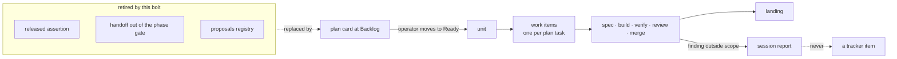

# Bolt: work-object-vocabulary

System: flywheel

The machinery still carries the work-object model that preceded the
plan card: released assertions, a handoff out of a phase gate, a
proposals registry a conductor drives. The book now states one path —
the planner files a card, the operator moves it to Ready, the loop
expands it into work items, and the stages drive those items. This
bolt moves the loops and the tracker vocabulary onto that path and
retires the other one.

Sequence: 2 of 4 · builds on: verification-frame

Price: `bolt-default` — per item a spec and a build session (`opus[1m]`)
and a verify session (`opus[1m]`), a review session (fable) only when
verify finds something; one landing session at the end. Task 2 is the
one most likely to spend a review round.

| # | change | delivers | chapters | after | why this bolt |
|---|--------|----------|----------|-------|---------------|
| 1 | work-item-vocabulary | the bolt's work objects are the items expansion files from plan tasks: `type:assertion` and the assertion vocabulary retire from the loops, and `flywheel-setup` converges the label set the tracker protocol names and no other | books/flywheel/src/tracker-protocol.md, books/flywheel/src/lifecycles.md, books/flywheel/src/glossary.md | — | the vocabulary is what every other statement in the cut is written in; it moves first |
| 2 | retire-handoff-release | nothing moves from an intent's items to a bolt: the handoff release and the phase gate leave the intent loop and the construction loop, and a bolt exists only from a plan card the operator moved to Ready | books/flywheel/src/design-loop.md, books/flywheel/src/bolt-planning.md, books/flywheel/src/construction-loop.md | 1 | the removal is stated in terms of the item model task 1 lands, so its specs derive from that merge |
| 3 | stage-set-alignment | the stage set the loop drives, named as the book names it — spec, build, verify, review, merge, landing — with verify's file channel and its `NONE` sentinel, review's ruling of proceed, refix or escalate with an unreadable ruling escalating, the budgeted fix round, and the pauses | books/flywheel/src/construction-loop.md | — | the file channels and the ruling are the loop's own contract with its sessions and touch no label the other tasks write |
| 4 | no-work-objects-from-construction | commitment 3 in the loops and the sessions they charge: a construction session creates no tracker item, an in-scope fix is work it does, and an out-of-scope finding goes to its report and stops | books/flywheel/src/commitments.md, books/flywheel/src/observation.md, books/flywheel/src/sessions.md | — | today every type skill queues discovery with `gh issue create`; the rule is one edit per skill and collides with nothing else here |

## Left out

- Dispatch and the relay — delivery marked by the relay comment, the
  nudge only on undelivered items, the Discord pairing as the
  operator's grant. It is its own subject and touches neither loop's
  stage path.
- The server's remaining duties: the doubling backoff hold, pane
  reaping once the run report has recorded what a pane held,
  `flywheel down`, and the one-shot archive through the gate.
- The session type names themselves, which follow the stage names this
  bolt fixes — the next bolt.

Derived from: book 66e3f169 · specs cce9c5c · in flight: add-flywheel-loops, observer

